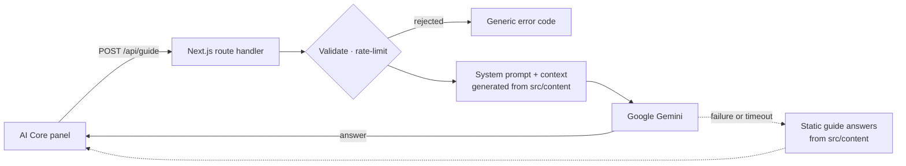

<div align="center">

# Sambit Biswas — 3D Portfolio

**An explorable 3D portfolio: guide a small robot through a golden-hour meadow where every landmark holds part of my work, and ask an AI guide that answers only from the portfolio itself.**

### [🌐 Live demo: www.sambitbiswas.me](https://www.sambitbiswas.me)

[](https://nextjs.org)
[](https://react.dev)
[](https://r3f.docs.pmnd.rs)
[](https://www.typescriptlang.org)
[](https://ai.google.dev)
[](https://vercel.com)

<a href="https://www.sambitbiswas.me">
  
</a>

</div>

---

## Contents

[Overview](#overview) · [Key features](#key-features) · [How it works](#how-the-3d-portfolio-works) · [AI Core](#gemini-ai-core) · [Tech stack](#technology-stack) · [Accessibility & mobile](#accessibility-and-mobile-support) · [Security](#security) · [Architecture](#project-architecture) · [Controls](#controls--interaction-guide) · [Local setup](#local-development-setup) · [Environment](#environment-variables) · [Deployment](#deployment) · [Preview](#screenshots--preview) · [Author](#author) · [License](#license)

## Overview

Instead of a page of cards, this portfolio is a small world to explore. A robot explorer starts in a central plaza. Paths lead to six landmarks, and each one opens part of the portfolio:

| Landmark | Section | What's inside |
| --- | --- | --- |
| 🔷 AI Core (plaza terminal) | AI guide | Ask questions about the portfolio, answered by Gemini |
| 🛠️ Research workshop | Projects | One pedestal per project, each with its own detail panel |
| 💎 Crystal garden | Skills | One crystal per skill category |
| 🪨 Milestone path | Experience | Experience and education milestones |
| 🔥 Campsite | About | Introduction, background and interests |
| 🗼 Lighthouse | Contact | GitHub, LinkedIn and email |

The same content is always available as a clean, accessible HTML page ("View as a page"). Search engines, screen readers and browsers without WebGL 2 get that version too.

## Key features

- **Explorable 3D world.** A stylised low-poly meadow with real-time shadows, wind-swayed foliage, water, smoke, campfire embers and golden-hour lighting.
- **Physics-based movement.** Rapier physics gives the robot collisions with scenery, invisible world boundaries and pushable crates.
- **Animated robot explorer.** Walk cycle synced to ground speed, leaning into acceleration, banking in turns, a spring-loaded antenna and idle glances.
- **Content-driven world.** Pedestals, crystals and milestones are generated from typed content files, so adding a project adds its pedestal.
- **Gemini AI guide.** A grounded AI assistant that answers only from portfolio content, with an offline fallback.
- **Cinematic camera.** A follow camera with look-ahead, an arrival vista over the whole map, and smooth focus when a panel opens.
- **Fast travel.** Jump to any landmark from the menu; zones you've opened are tracked.
- **Procedural audio.** Ambience, zone sounds, footsteps and AI cues, all synthesised in the browser with no audio files.
- **Touch support.** Floating joystick, contextual interact button and bottom-sheet panels on phones and tablets.
- **Accessible by design.** Semantic HTML portfolio, keyboard navigation, screen-reader support and reduced-motion handling.
- **Graceful degradation.** Missing WebGL 2, a failed GPU context, missing audio or an unavailable AI all fall back cleanly.
- **SEO-ready.** Metadata, generated Open Graph image and icons, `robots.txt` and `sitemap.xml`.

## How the 3D portfolio works

- **Static page, client-side world.** The page is server-rendered as static HTML. The 3D scene is loaded only in the browser (`next/dynamic` with `ssr: false`) after a WebGL 2 check, so three.js and the physics engine stay out of the first-load bundle (about 205 KB of gzipped JavaScript).
- **One source of truth.** Everything (world placements, panels, the HTML page, the AI's knowledge, page metadata and the preview image) is generated from typed files in [`src/content/`](src/content).
- **Rendering.** React Three Fiber renders the scene. Scenery is instanced (one draw call per part type) and chunked so off-screen forest is culled. Geometries and materials are shared singletons, and foliage and grass sway in custom vertex shaders driven by shared wind uniforms.
- **Physics.** Rapier (WebAssembly) handles the robot's capsule collider, fixed colliders for scenery and landmarks, walls at the world's edge, and dynamic crates.
- **Interaction.** Every zone ring and every object inside it is a target. Walking into one shows a prompt; the most specific target wins, so a project pedestal beats the workshop ring around it.
- **Camera.** A north-facing, fixed-pitch follow camera with spring smoothing and look-ahead. It shows the full map on arrival and from **Menu → View world**.
- **Efficiency.** Rendering pauses while the HTML page covers the world, audio suspends when muted or when the tab is hidden, and touch devices adapt rendering quality to the measured frame rate.

## Gemini AI Core

The AI Core at the centre of the plaza is a conversational guide to the portfolio.



- **Grounded.** The model's only knowledge is generated from `src/content`. The system prompt forbids inventing jobs, dates, awards, certificates, technologies or contact details. It keeps the guide in the third person, so it never claims to be Sambit, and it declines off-topic requests and attempts to reveal its instructions.
- **Server-side only.** The browser talks to `/api/guide`, never to Gemini. The API key is read only in server code.
- **Hardened endpoint.**
  - Accepts JSON only, with a 24 KB body cap enforced while streaming.
  - Questions are capped at 500 characters, and only the last 9 messages of history are sent.
  - Rate-limited to 12 requests per minute per IP.
  - Each Gemini attempt times out after 12 s, with one quick retry on server errors.
- **Always answers.** If the key is missing, Gemini fails, the request times out or the visitor is offline, the panel answers common questions directly from the content files.
- **Honest status.** The panel shows "AI guide available" until Gemini has actually answered, then "Live", or "Offline guide" when the live model isn't reachable.
- **Model.** `gemini-flash-lite-latest` by default (fast answers from a small, fixed context), overridable with `GEMINI_MODEL`.

## Technology stack

| Area | Technology |
| --- | --- |
| Framework | [Next.js 16](https://nextjs.org) (App Router, Turbopack), [React 19](https://react.dev), TypeScript (strict) |
| 3D | [three.js](https://threejs.org), [React Three Fiber](https://r3f.docs.pmnd.rs), [drei](https://drei.docs.pmnd.rs) |
| Physics | [Rapier](https://rapier.rs) via `@react-three/rapier` (WebAssembly) |
| AI | [Google Gemini](https://ai.google.dev) via the `@google/genai` SDK, server-side |
| Styling | [Tailwind CSS 4](https://tailwindcss.com), [Fredoka](https://fonts.google.com/specimen/Fredoka) via Fontsource |
| State | [Zustand](https://zustand.docs.pmnd.rs) |
| Audio | Web Audio API (procedural synthesis) |
| Quality | ESLint (Next.js core-web-vitals + TypeScript rules), `tsc --noEmit` |
| Hosting | [Vercel](https://vercel.com), custom domain [sambitbiswas.me](https://www.sambitbiswas.me) |

## Accessibility and mobile support

**Accessibility**

- **Full HTML version.** The whole portfolio is rendered as semantic HTML: visually hidden in the world, but readable by screen readers and crawlers, and shown with **View as a page**.
- **Keyboard.** "Skip to the portfolio as a page" is the first Tab stop. The world, menu and panels are keyboard-operable, and Esc closes things in a predictable order (panel, vista, menu, page view). Opening a panel moves focus into it, and closing the menu with Esc returns focus to the Menu button.
- **Screen readers.** The 3D canvas is hidden from assistive technology. Panels are labelled dialogs, and the AI conversation and status messages use live regions.
- **Reduced motion.** `prefers-reduced-motion` turns camera glides into cuts and stills ambient motion such as wind, dust motes and the robot's idle animation.
- **Fallbacks.** Without WebGL 2, or if the 3D world fails to start, visitors get the HTML portfolio instead of a broken canvas.

**Mobile and touch**

- **Detection.** Touch-first devices (coarse pointer, no hover) switch to touch controls automatically; hybrid devices switch on their first touch.
- **Controls.** A floating analog joystick in the lower-left and a contextual interact button in the lower-right.
- **Panels.** Bottom sheets on phones that stay above the on-screen keyboard, with safe-area padding for notches and home indicators.
- **Adaptive quality.** Touch devices start at a medium or low rendering tier, chosen from the device, and step between tiers based on measured frame rate. Desktop renders at full quality.

## Security

- **Secrets stay on the server.** `GEMINI_API_KEY` is read only in server modules guarded by `server-only`, never uses a `NEXT_PUBLIC_` prefix, and never reaches the client bundle. `.env.local` is git-ignored.
- **Request validation.** JSON-only content type (so other sites can't post from a visitor's browser), body size cap, message length and role checks, history window, and per-IP rate limiting.
- **No leakage.** Error responses are generic codes; provider messages and secrets are never returned. Server logs record only the failure type and HTTP status.
- **Security headers.** `X-Content-Type-Options: nosniff`, `X-Frame-Options: DENY`, `frame-ancestors 'none'`, `Referrer-Policy` and `Permissions-Policy`, plus HSTS from Vercel. API responses are `Cache-Control: no-store`.
- **Safe rendering.** AI answers are rendered as plain text, never as HTML.

## Project architecture

```
src/
├── app/                  Page, layout & metadata, error pages, icons, Open Graph image,
│   │                     robots.txt, sitemap.xml
│   └── api/guide/        AI guide route handler (server-only)
├── content/              Portfolio content: the single source of truth
├── components/
│   ├── 3d/               Scene, camera, lights, scenery, player, zones, props, interaction
│   ├── ui/               HUD, menu, panels, touch controls, HTML portfolio, fallbacks
│   ├── content/          Content blocks shared by panels and the HTML page
│   └── brand/            Site mark used for the icons and preview image
├── lib/
│   ├── guide/            AI guide: context builder, prompt, Gemini client, validation,
│   │                     rate limiter, static fallback
│   └── …                 World layout, paths, placements, interactables, textures
├── audio/                Procedural audio engine and sound recipes
├── stores/               Zustand stores (world/UI state, device) and per-frame runtime values
├── hooks/                Keyboard, device detection, on-screen keyboard, reduced motion
└── config/               World tuning, quality tiers, controls, site URL
```

**Editing the portfolio:** change the typed files in [`src/content/`](src/content) (`profile.ts`, `projects.ts`, `skills.ts`, `experience.ts`, `education.ts`, `certificates.ts`, `social.ts`). The world, panels, HTML page, AI context and metadata all update from them.

## Controls / interaction guide

| Action | Keyboard & mouse | Touch |
| --- | --- | --- |
| Move | `W` `A` `S` `D` or arrow keys | Drag the joystick (lower-left) |
| Interact with what's nearby | `E` or `Enter`, or click the prompt | Tap the interact button (lower-right) |
| Close a panel / go back | `Esc` or **Back to the world** | **Back to the world** |
| Fast travel | **Menu → Travel to** | **Menu → Travel to** |
| See the whole map | **Menu → View world**, then move or `Esc` to return | **Menu → View world**, then **Return to the world** |
| Read it as a web page | **Menu → View as a page**, or the first `Tab` stop | **Menu → View as a page** |
| Sound on / off | Sound button (top right) | Sound button (top right) |
| Ask the AI Core | `Enter` to send, `Shift`+`Enter` for a new line | Type and tap send |

Cyan means interactive: walk up to a glowing ring, pedestal, crystal or milestone and a prompt appears. The dots in the top-right corner track the zones you've discovered.

## Local development setup

**Prerequisites:** Node.js 20.9 or newer, and npm.

```bash
git clone https://github.com/Sambit1110/Portfolio.git
cd Portfolio
npm install
cp .env.example .env.local   # optional: add a Gemini API key
npm run dev                  # http://localhost:3000
```

The site works without a key; the AI Core then answers from the content files and shows "Offline guide".

| Script | Purpose |
| --- | --- |
| `npm run dev` | Development server with hot reload |
| `npm run build` | Production build |
| `npm run start` | Serve the production build |
| `npm run lint` | ESLint |
| `npm run typecheck` | TypeScript check (no emit) |

## Environment variables

Copy [`.env.example`](.env.example) to `.env.local`. Never commit real keys.

| Variable | Required | Description |
| --- | --- | --- |
| `GEMINI_API_KEY` | No | Enables the live AI guide. Server-only; must **not** use a `NEXT_PUBLIC_` prefix. |
| `GEMINI_MODEL` | No | Overrides the model (default `gemini-flash-lite-latest`). |
| `SITE_URL` | No | Public URL for canonical links, Open Graph, `robots.txt` and `sitemap.xml`, e.g. `https://www.sambitbiswas.me`. Read at build time; falls back to Vercel's production URL, then localhost. |

## Deployment

The site runs on **Vercel** at **[www.sambitbiswas.me](https://www.sambitbiswas.me)**.

1. Import the repository into Vercel (framework preset: Next.js; build command `next build`).
2. Add `GEMINI_API_KEY` and `SITE_URL` under **Project Settings → Environment Variables**, plus `GEMINI_MODEL` if you want a different model.
3. Add the custom domain under **Project Settings → Domains**.

How it runs in production:

- The page, icons, Open Graph image, `robots.txt` and `sitemap.xml` are prerendered at build time.
- `/api/guide` runs as a Node.js serverless function (`maxDuration = 30`).
- Rapier's WebAssembly is inlined in its JavaScript chunk, so no extra asset setup is needed.
- The rate limiter is in memory, per server instance. For stronger guarantees, add Vercel Firewall rate limiting or a shared store such as Upstash Redis.

## Screenshots / preview

The card at the top of this README is the site's Open Graph preview, generated at build time from `src/content`. The best preview is the world itself:

<div align="center">

**[Explore the live world at www.sambitbiswas.me →](https://www.sambitbiswas.me)**

</div>

<!-- To add in-world screenshots, save them under docs/screenshots/ and reference them here, e.g.
 -->

## Author

**Sambit Biswas**, AI/ML Engineer & Full-Stack Developer

- 🌐 Portfolio: [www.sambitbiswas.me](https://www.sambitbiswas.me)
- 💻 GitHub: [@Sambit1110](https://github.com/Sambit1110)
- 💼 LinkedIn: [linkedin.com/in/sambit-biswas](https://www.linkedin.com/in/sambit-biswas-927a6732b/)
- ✉️ Email: [sambitbiswas1110@gmail.com](mailto:sambitbiswas1110@gmail.com)

## License

© 2026 Sambit Biswas. All rights reserved.

No open-source license has been granted for this repository yet. You're welcome to read the code and learn from it, but please don't reuse or redistribute it without permission. The Fredoka font is used under the [SIL Open Font License 1.1](https://openfontlicense.org).
